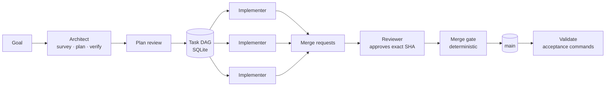

<div align="center">

# Colony

Colony runs coding agents against your repositories, unattended. Give
it a goal. It plans the work as a graph of tasks, runs an agent on each
task in parallel on its own branch, and merges each branch only after
checks pass in a clean clone. State is one SQLite file plus your Git
host. Models are whatever OpenAI-compatible endpoint you point it at.

[](#status)
[](#status)
[](#quick-start)
[](#status)
[](#colony-is-built-with-colony)

[Quick start](#quick-start) · [How it works](#how-it-works) · [Merge gate](#the-merge-gate) · [Status](#status)

<!-- HERO: 15–20 s GIF of the console scope sheet. Open a scope, watch the
     DAG appear (planning), nodes turn running → mr_open → merged in
     parallel, scope flips to validating → done. Capture at 880px wide. -->


<sub>One scope, goal to merged <code>main</code>. Every merge request in this repository since August was gated and merged by Colony.</sub>

</div>

## The workflow it is built for

You write a goal, not a task list. Colony's architect surveys the
repository, cuts the goal into at most twenty outcome-oriented tasks
with dependency edges and acceptance commands, and a second model
reviews that plan (the plan's reviewer is never the plan's author).
Then the graph runs: every task whose dependencies are merged gets a
fresh implementer session, a branch, and a merge request. Reviewers
approve exact commit SHAs. The merge gate clones the target branch,
merges the candidate on top, runs your checks, re-verifies the MR head
has not moved, and merges that exact SHA. When the last task lands,
Colony re-clones `main` and runs the scope's acceptance commands one
more time.

Nothing needs you in between unless you want it to. `hitl.mode: gated`
holds the plan until you approve it; `--manual` scopes additionally
require you to approve each merge at a specific SHA. `yolo` runs
unattended. Either way, an ntfy push tells you when a decision is
yours to make.

## What you get

- **Goal in, merged `main` out.** A scope becomes a task DAG, parallel
  branches, merge requests, gated merges, and a post-merge validation
  run. Every run's envelope, transcript, and artifacts are recorded in
  one SQLite file so you can reconstruct any decision afterwards.
- **Nothing merges on faith.** Agent output is evidence, never
  authority. `colonyd` verifies branch and SHA facts with the Git host before
  any state transition. The gate runs in a fresh clone with a
  credential-scrubbed workspace, scans the incoming diff for secrets,
  requires a green pipeline when one exists, runs `colony.gate.yaml`,
  and merges only the SHA it tested.
- **One SQLite file plus your Git host is the whole state.** No queue, no
  Postgres, no cloud account. Restart `colonyd` mid-run: leases expire,
  tokens are revoked, tasks requeue with backoff. Infrastructure
  failures never consume an agent's attempt budget.
- **Any OpenAI-compatible model, per role, with fallbacks.** Architect,
  implementer, and reviewer each route to their own model with an
  ordered fallback chain and a per-model concurrency cap. Colony's own
  history was built on a rotating zoo of cheap and open models; the
  gate, not the model, guards `main`.
- **Real isolation when you want it.** On Kubernetes each agent runs in
  a Kata VM pod: non-root, no service-account token, dropped
  capabilities, egress limited to DNS and the tool gateway. On a laptop
  the in-process engine confines agents to their workspace.
- **Operator surfaces you can actually run a fleet from.** A web
  console served by `colonyd`, a `colony` CLI and TUI, ntfy push
  notifications with cooldown and digests, Prometheus/OTLP metrics for
  tokens and cost per run, and an append-only `/audit` log.

## Colony is built with Colony

Since August 2026 the merge requests into this repository have been
planned, implemented, gated, and merged by Colony running on a single
homelab cluster. Colony branches are named `colony/<task-id>`; count
them yourself:

```sh
git log --merges --format=%s | grep -c "colony/col-"
```

A 48-hour lab window looks like this: 300 agent runs, 130 agent-hours,
12 different models, 137 runs succeeded, 156 failed, 16 merges landed.
Failure is the normal case in an agent fleet. Colony is designed so
that failed runs cost retries, not `main`.

## How it works

One process, `colonyd`, owns everything: an HTTP API, a single-flight
reconciler tick, SQLite persistence, and the agent runs themselves.



Every tick runs the same fail-isolated phases: expire dead leases,
poll the Git host for open MRs, advance tasks on observed facts, plan scopes,
dispatch implementers up to `COLONYD_MAX_CONCURRENT`, close scopes.
Tasks move `queued → running → mr_open → merged`; scopes move
`draft → planning → active → validating → done`, with `blocked` and
`paused` as first-class states you can act on.

| Role          | Runs as                                    | Sees                                                 | Produces                                                                   |
| ------------- | ------------------------------------------ | ---------------------------------------------------- | -------------------------------------------------------------------------- |
| Architect     | Three fresh sessions: survey, plan, verify | Read-only repo tools; subagents in survey and verify | A validated DAG of ≤20 tasks with requirements, files, acceptance commands |
| Plan reviewer | Fresh session, different model             | Read-only repo tools                                 | `approve` / `request_changes` on the plan                                  |
| Implementer   | One fresh session per task attempt         | Read/write/edit/bash; pushed head verified           | A branch and merge request                                                 |
| Reviewer      | Fresh session per MR head                  | Read-only repo tools                                 | Verdict bound to an exact SHA                                              |
| Merge gate    | Deterministic, no model                    | Fresh clone, scrubbed credentials                    | Merge of the tested SHA, or evidence and a requeue                         |
| Validate      | Deterministic, no model                    | Fresh clone of `main`                                | Pass/fail of scope acceptance commands                                     |

Every session starts clean with a purpose-built packet: the task spec,
the project's operator-authored context document, and nothing from
another agent's transcript. When `COLONY_SEARXNG_URL` is set, agents
also get `web_search` and `web_fetch` behind a strict SSRF filter.

## The merge gate

The gate is the part that lets you walk away. In order:

1. Fresh clone of the target branch; fetch the task branch.
2. Scan the incoming diff for `.env`, `PACKET.json`, GitLab and AWS
   tokens, private keys.
3. `git merge --no-ff` the candidate head onto the target.
4. Run each command in `colony.gate.yaml` (default timeout 600 s,
   last 200 lines retained as evidence).
5. If the project has CI, the pipeline for that SHA must be `success`.
6. Re-fetch the MR. If the head moved, abort.
7. Merge with `sha: <tested head>`. The task is `merged` only when a
   later poll observes the host reporting it merged at that SHA.

Gates serialize per scope. Three failures on the same head block the
task for a human. Transient host refusals hold the task for re-gating
instead of burning attempts.

```yaml
# colony.gate.yaml, in the target repository
commands:
  - bun run typecheck
  - bun test
timeout_seconds: 900
```

## Quick start

Requirements: Bun 1.3+, Git, a GitLab instance (self-hosted or
gitlab.com) with a project-access token that has `api` scope, and one
OpenAI-compatible endpoint (LiteLLM, OpenRouter, Ollama, llama-server).

```sh
git clone <repo-url> colony && cd colony
bun install
cp .env.example .env            # GITLAB_BASE_URL, GITLAB_TOKEN, COLONY_OPENAI_COMPATIBLE_API_KEY
cp config/colony.example.yaml config/colony.yaml   # set base_url and one model per role
bun run dev                     # colonyd on http://localhost:4400
```

Open the console at `http://localhost:4400`, or use the CLI:

```sh
cd apps/cli && bun link && cd -
export COLONY_URL=http://localhost:4400
cat > goal.md <<'EOF'
Add a GET /version endpoint that returns the git SHA and build time.
Cover it with a test. Document it in the README.
EOF
colony open goal.md --title "version endpoint" --repo group/my-repo --project demo --create-project
colony                          # TUI: watch the scope, approve the plan with `a`
```

Everything Colony knows lives in `data/colonyd.db`. Delete it and you
start over; back it up and you can move the factory to another machine.

The full development, e2e, and Kubernetes sandbox setup is in
[`docs/`](docs/) and [`packages/sandbox-k8s/README.md`](packages/sandbox-k8s/README.md).

## Status

Early access. Colony builds itself and runs on one homelab cluster
every day, but the interfaces and SQLite schema still change without a
migration path.

- **GitLab is the only Git host adapter shipped today.** The provider
  interface is host-agnostic (and has a fake adapter the test suite runs
  against); GitHub and others are adapters yet to be written.
- **API-key providers only.** Any OpenAI-compatible endpoint works.
  Codex and Claude subscription OAuth appear in the config schema but
  the runtime rejects them today.
- **Isolation is a deployment choice.** The Kubernetes engine gives you
  Kata VMs; the default in-process engine runs agents as the `colonyd`
  user with workspace path confinement only. Point the in-process
  engine at repositories and machines you are willing to let an agent
  modify.
- **Bun, not Node.** The agent runtime depends on Bun-native
  TypeScript and runs without a build step.

## Documentation

[CLI and TUI](apps/cli/README.md) ·
[Kubernetes sandboxes](packages/sandbox-k8s/README.md) ·
[Configuration](config/colony.example.yaml) ·
[Run auditing](docs/research/2026-08-30-agent-run-audit.md)

## License

TBD.
