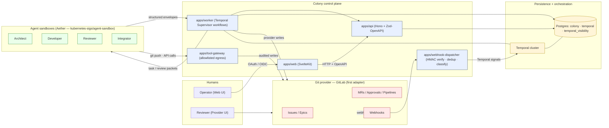

# Colony

Colony is an AI software team control plane. A human opens a bounded **scope**, Colony decomposes it into a dependency graph of tasks, agents implement and review the work, and human-in-the-loop gates decide when specs, merges, releases, and closeout may proceed.

The source of truth is Colony’s Task Graph and audit log; Git providers are the collaboration surface where humans review issues, comments, MRs/PRs, approvals, and pipelines. GitLab is the first adapter, but the system is designed around provider abstractions, durable Temporal workflows, explicit capabilities, structured agent outputs, and reconciled “done” semantics.

## System diagram



The webhook dispatcher only **signals** — never writes the provider. Provider writes are performed by Supervisor activities (via `apps/api`/`packages/provider-gitlab`) or by agent sandboxes through the tool-gateway git proxy. Postgres holds Task Graph state, audit log, agent run metadata, and Temporal's own schemas (separate databases). See [`docs/design.md`](docs/design.md) §5 for the full architecture.

## Documentation

| Document                               | Purpose                                                                                    |
| -------------------------------------- | ------------------------------------------------------------------------------------------ |
| [`docs/seed.md`](docs/seed.md)         | Original architecture seed: roles, HITL policy, reconciliation, packets, deployment sketch |
| [`docs/design.md`](docs/design.md)     | Technical design: components, domain model, APIs, security, rollout                        |
| [`docs/tasks.md`](docs/tasks.md)       | Dependency-aware implementation plan (Phase 0–4), with per-task progress checkboxes        |
| [`docs/dev-loop.md`](docs/dev-loop.md) | How to boot the local stack and run the dev loop                                           |
| [`docs/adr/`](docs/adr/README.md)      | Architecture Decision Records                                                              |

## Repository layout

TypeScript **npm workspaces** monorepo (Node **24+**).

**Applications** (`apps/`):

- `api` — Hono HTTP API: Task Graph, health, OpenAPI docs
- `worker` — Temporal worker for Supervisor workflows
- `webhook-dispatcher` — Provider webhook ingress with HMAC verification
- `tool-gateway` — Allowlisted tool/proxy egress (future)
- `web` — SvelteKit operator web UI

**Packages** (`packages/`):

- `domain` — Core domain types and state (future)
- `db` — Persistence layer (future)
- `policy` — Capability / policy engine (future)
- `provider` — Provider adapter interfaces and shared provider types (future)
- `provider-gitlab` — GitLab provider adapter implementation (future)
- `workflows` — Temporal workflow-safe deterministic code (future)
- `agent-runtime` — Pi / sandbox run adapter boundary (future)
- `config` — Shared environment and service configuration
- `observability` — Shared logging, metrics, and tracing setup (future)
- `schemas` — Zod / envelope schemas (future)
- `testing` — Shared test helpers (future)

## Development

The canonical toolchain lives in a **Nix flake** so local environments match CI and infrastructure assumptions (Node 24, Temporal CLI, Postgres client, Kubernetes client tooling, GitLab CLI, container tools, `docker-compose`). Local infrastructure (Temporal + Postgres) runs under **Docker Compose**; the Node apps run directly as `npm run dev` watch processes. There is no local Kubernetes — k8s validation happens on Aether. See [ADR-004](docs/adr/004-local-development-tooling.md).

Quickstart:

```bash
nix develop
cp .env.example .env
npm install
docker-compose up -d
npm run dev
```

Then open http://localhost:3000 for the web UI and http://localhost:4000/docs for the API reference. Full walkthrough (including home-lab GitLab webhook setup) lives in [`docs/dev-loop.md`](docs/dev-loop.md). Architecture decisions are captured in [`docs/adr/`](docs/adr/README.md).

Checks:

```bash
npm run typecheck
npm test
npm run lint
npm run format:check
```

Validate the flake:

```bash
nix flake check
```

---

_Implementation status: Phase 0 foundations in progress; see [`docs/tasks.md`](docs/tasks.md) for the critical path._
