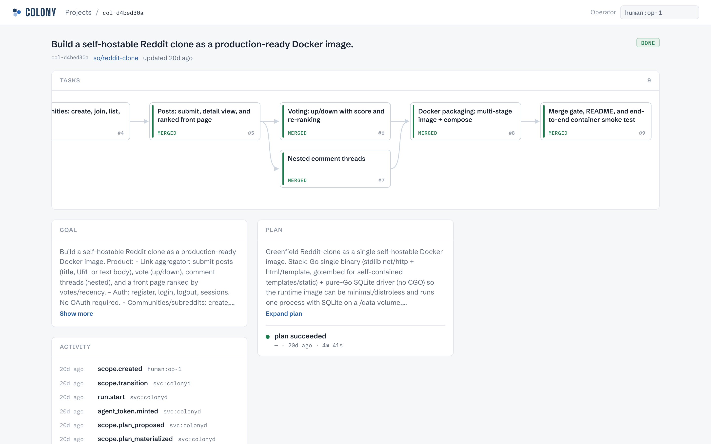
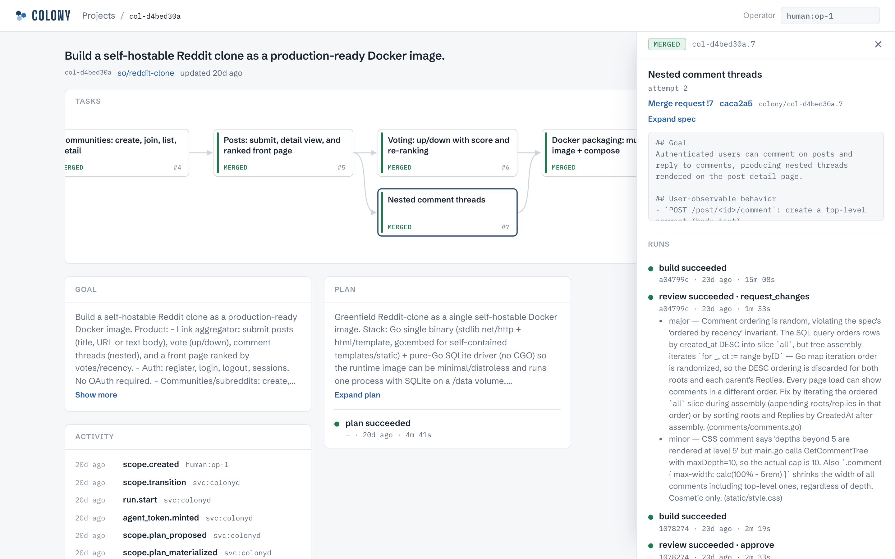
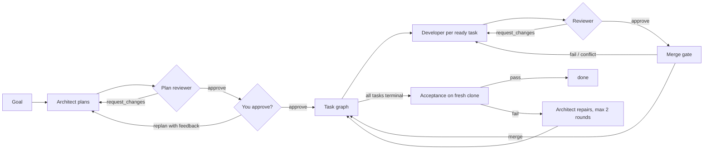
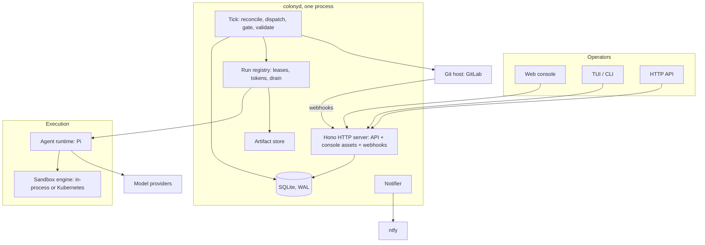

# Colony

Colony is a self-hosted control plane that turns a written engineering goal
into merged code. It runs a team of coding agents against your
repositories, unattended: an architect agent decomposes the goal into a
dependency graph of tasks; developer agents implement the tasks in
parallel, each on its own branch and merge request; reviewer agents and a
deterministic merge gate decide what lands on `main`; an acceptance run on
the merged result decides whether the goal is met. You approve plans,
unblock tasks, and answer when the architect cannot.

`colonyd` is one process; its state is one SQLite database plus your Git
host. It is operated from a web console, a terminal UI, a CLI, or the HTTP
API.

[](#status)
[](#license)

[Concepts](#concepts) · [Example](#a-scope-start-to-finish) · [Lifecycle](#how-a-scope-runs) · [Agents](#agents) · [Models](#models-and-fallbacks) · [Architecture](#architecture) · [Sandboxes](#sandboxes) · [Install](#install) · [Deploy](#deploy) · [Interfaces](#interfaces) · [Integrations](#integrations) · [Status](#status)

## Concepts

**Project.** A named container for related work. It holds a Markdown brief
and reference files that every agent working under the project receives:
architecture notes, conventions, forbidden areas, how to run the tests.
Projects have a scopes list, a running-tasks tab, and settings.

**Scope.** One goal against one repository: the goal text, the plan, the
acceptance commands, an approval mode (`auto` or `manual` merges), and a
status: `draft`, `planning`, `active`, `validating`, `blocked`, `paused`,
`done`, `abandoned`. A scope belongs to a project or stands alone.

**Task.** One node of the plan: a spec, its dependencies on other tasks, and
one branch and merge request. Task ids are `scope.N`. States: `queued`
until its dependencies merge, `running`, `mr_open`, `merged`, `blocked`
(needs you), `canceled`. A task whose work is already on the default
branch goes straight to `merged` with no merge request. Tasks record retry
attempts, reviewer findings, and any feedback you gave them.

**Run.** One execution attempt, attached to a scope and usually a task.
Kinds: `architect`, `plan_review`, `implement`, `review`, `merge_gate`,
`validate`. A run keeps its lease, base and head SHAs, the model that
actually ran it, its event stream, its evidence, and its artifacts.

## A scope, start to finish

Scope `col-d4bed30a`, 2026-08-16, target: an empty GitLab project. The
goal, condensed from the operator's text:

> Build a self-hostable Reddit clone as a production-ready Docker image.
> Posts, up/down votes, nested comments, ranked front page. Auth with
> sessions, no OAuth. Communities: create, join, list, post into.
> Server-rendered UI, SQLite, one container. Multi-stage Dockerfile, port
> 8080, compose file, README with exact commands, and a `colony.gate.yaml`
> that `docker build`s the image so the merge gate proves it packages.

**Plan.** Nine tasks. Task 2 owns the entire schema so no feature task
writes a migration; 6 (voting) and 7 (comments) depend only on 5 and run
in parallel:

```
1 skeleton ─ 2 schema ─ 3 auth ─ 4 communities ─ 5 posts ─┬─ 6 voting ───┬─ 8 docker ─ 9 gate+README+smoke
                                                           └─ 7 comments ─┘
```

**Result.** 9 merge requests merged. 39 runs: 1 architect, 14 implement,
11 review, 13 gate. Task 9's gate ran `docker build` and the smoke test
against the merged tree (scope-level acceptance runs did not exist yet).
174 audit events, 2 human: `scope.created`, and one `unblock` after
GitLab returned `401` on the first merge three times and the operator
replaced the token.



The scope sheet: task graph by dependency, each node in its terminal
state; the goal, the architect's plan and run, and the audit feed. Every
operator action is a button here and an audit row with your actor id.



Task 7's drawer: spec, branch, MR `!7`, and its eight runs in order.

1. implement → review `request_changes`: the comment tree was built by
   iterating a Go map, so ordering was random despite the `ORDER BY`.
2. implement → review `approve` → gate **failed**: merge conflict with
   task 6, which had merged in parallel.
3. implement (on the new `main`) → review `approve` → gate passed → merged
   at the gated SHA `caca2a5`.

Full timeline in [docs/examples/reddit-clone.md](docs/examples/reddit-clone.md).

## How a scope runs



1. **Plan.** The architect inspects the repository and produces a task
   graph: per task, a spec, the files it expects to touch, the evidence
   commands that prove it, and its dependencies. It also writes the scope's
   acceptance commands.
2. **Review the plan.** With `review.mode: required`, a plan reviewer reads
   the plan against the checked-out repository and approves or sends it
   back with findings; the architect revises. After ten rejections the
   scope blocks and asks you.
3. **Approve.** With `hitl.mode: gated` you read the plan in the console and
   approve it or send it back with feedback. With `hitl.mode: yolo` the
   plan is applied automatically, unless the scope was opened `--manual`.
4. **Implement in parallel.** Every task whose dependencies have merged gets
   a developer run on its own branch, up to `COLONYD_MAX_CONCURRENT` at
   once and within per-model limits. The developer pushes, runs the spec's
   evidence commands, and reports the branch and head SHA. Colony confirms
   the branch and commit exist on the Git host before opening the merge
   request.
5. **Review the code.** With `review.mode: required`, a reviewer reads the
   exact merge request head and approves or requests changes with findings.
   Changes requested requeue the developer with the findings; approvals are
   tied to the SHA, so a new push is re-reviewed.
6. **Gate and merge.** If the merge request head has a CI pipeline, it must
   have succeeded. The merge gate then clones the target branch fresh,
   merges the candidate head into it, scans the incoming diff for
   credential patterns (GitLab and AWS tokens, private keys) and refuses
   `.env` or `PACKET.json`, runs the commands in the repository's
   `colony.gate.yaml` (each under `timeout_seconds`, default 600; no file
   or no commands means no checks), re-checks that the merge request head
   has not moved, and merges that exact commit. A conflict or failing
   command requeues the task; three consecutive gate failures at one head
   block it. If GitLab refuses the merge while a pipeline is still
   registering, the gate waits 60 s and retries; three refusals block.
   Gates serialize per scope so parallel tasks land one at a time.
7. **Validate.** When every task is terminal and at least one merged, Colony
   clones the default branch fresh and runs the acceptance commands with no
   credentials. Pass: `done`. Fail: the architect gets the failure evidence
   and up to two repair rounds (fix the acceptance criteria, or append
   repair tasks to the graph); then the scope blocks and asks you.

Retries are bounded (`COLONYD_MAX_ATTEMPTS`, default 3) with exponential
backoff. Failures classified as infrastructure (the daemon restarting
mid-run, the model gateway returning `429`/`5xx`, a sandbox that failed to
provision) do not consume attempts; failures the agent could have
prevented do. Every state change is reconciled by a single-flight tick
that reads facts back from the Git host. A restarted `colonyd` does not
resume in-flight runs: it marks them failed with `process_restart`,
revokes their tokens, and requeues their tasks at no attempt cost.

## Agents

Four LLM roles, each configured separately, plus two deterministic
processes that use no model.

| Role              | Runs when                                   | Reads                                         | Produces                                                           |
| ----------------- | ------------------------------------------- | --------------------------------------------- | ------------------------------------------------------------------ |
| **Architect**     | Scope created; replan; validation failed    | Goal, project brief and files, the repository | Task graph with specs, dependencies, evidence commands; acceptance |
| **Plan reviewer** | Plan proposed, `review.mode: required`      | Plan, the repository                          | `approve` or `request_changes` with findings                       |
| **Developer**     | Task ready; reviewer or gate sent it back   | Task spec, project context, prior findings    | Commits on the task branch, evidence, head SHA                     |
| **Reviewer**      | Merge request open, `review.mode: required` | The exact merge request head                  | `approve` or `request_changes` with findings and files inspected   |
| Merge gate        | Reviewer approved (or review off)           | Fresh clone, `colony.gate.yaml`               | Merge of the tested SHA, or evidence of the failure                |
| Validation        | All tasks terminal                          | Fresh default-branch clone, acceptance list   | `done`, or evidence for the architect's repair round               |

The architect runs in two stages with separate context: a planning stage
that inspects the repository and drafts, and a verification stage that
checks the draft against the goal and the repository and emits the final,
size-checked plan. Reviewer approvals require inspected files and a
substantive summary; a bare "looks good" is rejected by schema.

Agents run on [Pi](https://github.com/can1357/oh-my-pi) as the agent
runtime. Each agent receives a packet: its role's instructions, the project
brief and reference files, the scope goal, the task spec, and any prior
findings. Agents can be given web access (`COLONY_SEARXNG_URL`: search plus
an SSRF-filtered fetch). `AGENT_RUNTIME=fake` substitutes a deterministic
runtime that emits valid envelopes without calling a model; the test suite
pairs it with fake Git-host, gate, and validation adapters.

## Models and fallbacks

Each role names a provider and a model. Any OpenAI-compatible or Anthropic
endpoint works; the example config routes everything through a LiteLLM
gateway.

```yaml
providers:
  gateway:
    api: openai-completions
    base_url: https://litellm.example.com/v1
    auth: { kind: api_key, value: LITELLM_API_KEY } # env var name
    models:
      - id: deepseek-v4-flash
        context_window: 1048576
        max_tokens: 384000
      - id: glm-5.2
        max_parallel_runs: 2 # cap concurrent runs on this model
      - id: kimi-k3

agents:
  architect: { provider: gateway, model: glm-5.2 }
  plan_reviewer: { provider: gateway, model: kimi-k3 }
  developer:
    provider: gateway
    model: deepseek-v4-flash
    fallback_models: [glm-5.2, kimi-k3]
    thinking_level: high
    timeout_ms: 1800000
    max_turns: 250
  reviewer:
    provider: gateway
    model: kimi-k3
    fallback_models: [glm-5.2]
```

Fallbacks work at two points:

- **At dispatch.** If the primary model is at its `max_parallel_runs`, the
  run starts on the first fallback with a free slot instead of waiting.
- **During a run.** If the model errors or the provider is unavailable
  mid-session, the runtime fails over to the next model in
  `fallback_models` inside the same session and attempt. It prefers a
  fallback with a free slot; if every remaining fallback is capped it takes
  the next one anyway and logs `pi_model_fallback_all_capped`.

The run records the model that actually finished it, the fallback event is
in the run's event stream, and the architect, developer, and reviewer
models behind a merged task are written into the merge provenance.
Fallbacks are same-provider and
ordered. `plan_reviewer` inherits the `reviewer` entry if omitted.
Per-role `thinking_level`, `timeout_ms`, and `max_turns` bound cost;
per-model `cost` lets the console estimate spend per task.

## Architecture



| Component     | Where                                                   | Responsibility                                                                                                                                    |
| ------------- | ------------------------------------------------------- | ------------------------------------------------------------------------------------------------------------------------------------------------- |
| `colonyd`     | `apps/colonyd`                                          | The daemon. Boots config, store, provider, runtime, sandbox engine; serves HTTP; runs the tick every `COLONYD_TICK_MS` (15 s); drains on shutdown |
| Tick          | `apps/colonyd/src/tick.ts`                              | One deterministic pass: expire leases, poll the Git host, advance review/gate/merge, plan, dispatch developers, close scopes, validate            |
| Run handlers  | `apps/colonyd/src/runs/`                                | One module per run kind (`architect`, `plan-review`, `implement`, `review`, `merge-gate`, `validate`) plus `extend` for architect repair rounds   |
| Store         | `packages/core`                                         | SQLite schema, state machine (allowed transitions, backoff), audit log, plan materialization                                                      |
| Schemas       | `packages/schemas`                                      | Zod contracts for every agent envelope: plan, completion, verdicts. Agents that do not conform fail the run                                       |
| Agent runtime | `packages/agent-runtime`                                | `AgentRuntimeAdapter`: Pi runners per role, packet building, model failover, fake runtime                                                         |
| Sandboxes     | `packages/sandbox`, `sandbox-in-process`, `sandbox-k8s` | `SandboxEngine` protocol (provision, exec, read, write, destroy) and its two engines                                                              |
| Git host      | `packages/provider`, `packages/provider-gitlab`         | `ProviderAdapter`: repos, branches, merge requests, pipelines, webhooks; GitLab implementation and a fake                                         |
| Console       | `packages/console`                                      | Web UI: Lit web components served by `colonyd` at `/`, no build step, no CDN. `?demo` runs it offline on fixture data                             |
| CLI and TUI   | `apps/cli`                                              | `colony` binary: scope, task, run, and project operations as subcommands with `--json`; a live TUI with no arguments                              |
| Config        | `packages/config`                                       | `colony.yaml` schema (providers, agents, review, HITL, sandbox, notifications, artifacts) and the environment contract                            |
| Observability | `packages/observability`                                | OpenTelemetry traces per run, Prometheus metrics on `COLONY_METRICS_PORT`; the console links each run to its trace                                |

State is one SQLite database (WAL) plus your Git host. Colony treats the Git
host as the source of truth for branches, commits, merge request heads, and
merges: an agent's claim is verified against it before any state changes.
Run artifacts go to local disk or S3; session transcripts to
`sessions_dir`. Agents get per-run scoped tokens that are revoked when the
run ends.

## Sandboxes

`sandbox.engine` chooses where agent runs and scope validation execute.
The merge gate is not sandboxed by either engine: it clones and runs
`colony.gate.yaml` commands as a child of `colonyd`, with the daemon's
environment and credentials.

**`in-process`** (default). Agent commands are shell children of `colonyd`
with the run's workspace as working directory, a private `HOME`/`TMPDIR`,
and an allow-listed environment. Nothing prevents a command from reading
or writing outside the workspace: an agent has whatever the `colonyd` user
has. Use this engine only where you would give the agent that access, or
run `colonyd` in a container that has nothing else in it.

**`kubernetes`**. Each run gets a `Sandbox` custom resource handled by the
[agent-sandbox](https://github.com/kubernetes-sigs/agent-sandbox) controller
(v0.4), which creates a Kata VM-backed pod: non-root (uid 1000), no
service-account token, all capabilities dropped, `RuntimeDefault` seccomp,
an ephemeral workspace volume. The prepared workspace is streamed into the
pod; commands run over `pods/exec`; the pod is destroyed when the run ends.
Developer sandboxes get 2 CPU / 4 GiB; reviewer and validation sandboxes
1 CPU / 2 GiB. Egress is whatever your NetworkPolicy allows, keyed on the
`colony.shdr.ch/sandbox-role` pod label. Acceptance validation runs in the
sandbox too; only the merge gate stays on the daemon.

The sandbox image (`docker/sandbox/Dockerfile`) contains Node 24, Bun, git,
tar, and Chromium; it carries no Colony code. Add your project's toolchain
to it and set `sandbox.kubernetes.image`.

## Install

Requirements: [Bun](https://bun.sh) 1.3.14, Git, a GitLab **personal**
access token with `api` scope, one model endpoint with an API key.

The token type matters: by default Colony mints a short-lived project
access token per run (Developer role, 2-day expiry, scoped to that run's
repository) and revokes it when the run ends. GitLab only lets personal
access tokens create project tokens. To use `GITLAB_TOKEN` directly for
every run instead, set `COLONYD_SINGLE_TOKEN=1`; that token then also
needs whatever your branch protection requires to merge into the default
branch.

```sh
git clone <repo-url> colony && cd colony
bun install
cp .env.example .env
```

`.env`:

```dotenv
GITLAB_BASE_URL=https://gitlab.example.com
GITLAB_TOKEN=glpat-...
LITELLM_API_KEY=sk-...
COLONY_CONFIG_PATH=config/colony.yaml
COLONYD_MAX_CONCURRENT=3
```

`config/colony.yaml`: the `providers` and `agents` blocks from
[Models and fallbacks](#models-and-fallbacks), plus:

```yaml
agent_runtime: pi
hitl: { mode: gated } # you approve every plan
review: { mode: required } # plan reviewer and code reviewer on
sandbox: { engine: in-process }
```

In each repository Colony will work on, say what a merge must pass:

```yaml
# colony.gate.yaml
commands:
  - make test
```

Run:

```sh
bun run dev # console and API on http://localhost:4400
```

Then in the console: **New project**, paste the brief, add reference files,
**New scope**, write the goal, and wait for the plan to appear.
[`config/colony.example.yaml`](config/colony.example.yaml) is the annotated
reference config; [`packages/config/src/colony-config.ts`](packages/config/src/colony-config.ts)
is the schema.

`colonyd` listens on all interfaces on `COLONYD_PORT` (4400). Without OIDC
it trusts the `X-Actor-Id` header as the operator's identity, so keep it
off networks you do not control: a firewall, an SSH tunnel, or the
loopback-only port mapping in the Compose file below. With
`COLONY_OIDC_ISSUER`, `COLONY_OIDC_CLIENT_ID`, and optionally
`COLONY_OIDC_REQUIRED_ROLE` set, every operator request needs an RS256
bearer token from that issuer and the console signs in through it. The
console's login flow uses Keycloak's `protocol/openid-connect` endpoints;
other issuers work for API clients that bring their own token.

## Deploy

### Docker Compose

One container running `colonyd`, built from the repository `Dockerfile`.
The image ships without a config file; you mount `colony.yaml` and a
`data/` directory for the database, artifacts, and transcripts.

```yaml
# compose.yaml
services:
  colonyd:
    build: .
    env_file: .env
    environment:
      COLONY_CONFIG_PATH: /workspace/config/colony.yaml
      COLONYD_DB_PATH: /workspace/data/colonyd.db
    ports:
      - "127.0.0.1:4400:4400"
    volumes:
      - ./config/colony.yaml:/workspace/config/colony.yaml:ro
      - ./data:/workspace/data
    restart: unless-stopped
    stop_grace_period: 11m # >= COLONY_DRAIN_TIMEOUT_MS (10 min) + 60 s
```

```sh
mkdir -p data && chown 1000:1000 data # the image runs as uid 1000
docker compose up -d
curl -fsS localhost:4400/health
```

The container has git and a shell, not your project's toolchain. With
`sandbox.engine: in-process`, agents and acceptance commands run inside
it, so extend the image with what your repositories need, or move agent
execution to Kubernetes sandboxes below.

### Kubernetes

Two independent pieces: the daemon, and optionally a sandbox per agent run.

**The daemon.** Exactly one replica. On startup `colonyd` marks every run
the database shows as running failed (`process_restart`) and, with the
Kubernetes engine, deletes every Colony-labelled sandbox in its namespace;
two overlapping instances would destroy each other's work. Use
`strategy: Recreate`, one replica, and a namespace per instance. Give it:

- a PersistentVolumeClaim for the database, artifacts, and transcripts,
  mounted where `COLONYD_DB_PATH`, `artifacts.local.dir`, and
  `sessions_dir` point;
- `colony.yaml` from a ConfigMap, credentials from a Secret;
- liveness on `/health`, readiness on `/ready` (503 once draining starts);
- `terminationGracePeriodSeconds` of at least `COLONY_DRAIN_TIMEOUT_MS`
  (default 10 min) plus 60 s, so in-flight runs finish before the pod dies.

**Isolated agent runs.** Set `sandbox.engine: kubernetes`. Each run then
gets its own Kata VM pod (see [Sandboxes](#sandboxes)). The cluster needs,
per [`packages/sandbox-k8s/README.md`](packages/sandbox-k8s/README.md):

- the agent-sandbox v0.4 controller serving the `agents.x-k8s.io` `Sandbox` CRD;
- a `RuntimeClass` named `kata`;
- the `colony-sandboxes` namespace (configurable) with a NetworkPolicy on
  the `colony.shdr.ch/sandbox-role` label;
- RBAC for `colonyd` to `get`/`list`/`create`/`delete` sandboxes and
  `list` pods and use `pods/exec` in that namespace;
- your sandbox image built from `docker/sandbox/Dockerfile`, set as
  `sandbox.kubernetes.image`;
- a default StorageClass that provisions `ReadWriteOnce` volumes: each
  sandbox requests a generic ephemeral PVC, 16 GiB for developer runs and
  8 GiB for review and validation.

The engine uses in-cluster credentials when present and the default
kubeconfig otherwise. Colony ships no manifests or chart.
[`config/colony.deploy.yaml`](config/colony.deploy.yaml) is the `colony.yaml`
of the cluster that builds Colony itself: Kubernetes engine, storage under
`/var/lib/colonyd`, review required, `hitl: yolo`. Its registry and model
endpoints are private; read it for the shape, not the values.

### Operations

**Back up** `COLONYD_DB_PATH` (with `sqlite3 .backup`, or stop `colonyd`
first), `artifacts.local.dir`, and `sessions_dir`.

**Observe** with OpenTelemetry traces (`OTEL_EXPORTER_OTLP_*`; each run is
one trace, and with `COLONY_TRACE_UI_BASE_URL` set the console links to
it) and Prometheus metrics on `COLONY_METRICS_PORT`.

**Get paged** through `notifications.sinks` (ntfy) when a plan awaits
approval, a task blocks, or a merge lands. Each sink has a severity
threshold; each event class has a cooldown; lower-severity events batch
into a digest window.

## Interfaces

Everything below is the same HTTP API; the console, TUI, and CLI are
clients of it.

**Web console** at `/`. Projects list; project page with scopes, running
tasks, brief and reference files, settings; scope sheet with the task
graph, plan, acceptance results, and activity. Clicking a task opens its
spec, merge request, and run history with reviewer findings and a live
event feed, plus the task actions: unblock, stop and retry, run now,
request changes, amend spec, cancel, restore, approve merge.

**TUI.** `colony` with no arguments: live scopes and tasks in the terminal.

**CLI.** Scope, task, run, and project operations as subcommands, `--json`
for scripts. Not every route is covered: scope unblock, run abort,
project-file upload, and plan-review recovery are API-only.

```sh
colony context my-project --set brief.md
colony open goal.md --title "Reddit clone" --repo group/reddit-clone --project my-project
colony scope col-d4bed30a
colony approve col-d4bed30a            # or: colony replan col-d4bed30a --feedback notes.md
colony logs <run-id> -f
colony artifacts <run-id>
colony artifacts <run-id> get <artifact-id> -o out.bin
colony task col-d4bed30a.7 unblock
colony task col-d4bed30a.7 request-changes --feedback f.md
colony task col-d4bed30a.7 amend --spec s.md
colony pause col-d4bed30a && colony resume col-d4bed30a
colony task col-d4bed30a.7 approve-merge --sha <sha>   # scopes opened with --manual
```

Install: `(cd apps/cli && bun link)`, then `COLONY_URL=http://localhost:4400`.
Full reference in [apps/cli/README.md](apps/cli/README.md).

**HTTP API.** Routes in `apps/colonyd/src/http.ts`: `/projects` (brief,
files, running), `/scopes` (plan approval, replan, pause, resume, unblock,
acceptance, revalidate), `/tasks` (stop, cancel, restore, unblock, amend,
retry, request-changes, approve-merge), `/runs` (status, abort, events,
artifacts), `/audit`, `/health`, `/ready`, and the GitLab webhook. Send
`X-Actor-Id` or an OIDC bearer token. Examples in
[docs/development.md](docs/development.md).

## Integrations

| Boundary          | Interface                                                           | Shipped                                   | Where to add one                                                |
| ----------------- | ------------------------------------------------------------------- | ----------------------------------------- | --------------------------------------------------------------- |
| Git host          | [`ProviderAdapter`](packages/provider/src/index.ts)                 | GitLab                                    | `packages/provider-<host>`, wired in `apps/colonyd/src/main.ts` |
| Agent runtime     | [`AgentRuntimeAdapter`](packages/agent-runtime/src/adapter.ts)      | Pi; fake for tests                        | `packages/agent-runtime`, selected by `agent_runtime:`          |
| Sandbox engine    | [`SandboxEngine`](packages/sandbox/src/exec-protocol.ts)            | in-process, Kubernetes (Kata)             | `packages/sandbox-<engine>`, selected by `sandbox.engine:`      |
| Model provider    | `providers:` in `colony.yaml`                                       | OpenAI-compatible, Anthropic APIs         | Config only                                                     |
| Notification sink | [`notifications/sinks.ts`](apps/colonyd/src/notifications/sinks.ts) | ntfy                                      | Add a sender and a `kind`                                       |
| Artifact store    | `artifacts.kind` in `colony.yaml`                                   | local disk, S3                            | Config only                                                     |
| Operator auth     | `COLONY_OIDC_*`                                                     | Keycloak (console + API), or `X-Actor-Id` | RS256 tokens from any issuer for API clients                    |
| Telemetry         | `OTEL_EXPORTER_OTLP_*`, `COLONY_METRICS_PORT`                       | OTLP traces, Prometheus metrics           | Config only                                                     |

Each code boundary is a TypeScript interface with a fake the test suite
runs against; a new implementation registers where the existing one is
constructed.

## Status

Early access. Colony has planned, implemented, reviewed, gated, and merged
its own merge requests since August 2026. The SQLite schema is migrated
forward automatically on boot; there is no downgrade, so back up
`COLONYD_DB_PATH` before upgrading. Interfaces between packages still
change without notice. GitLab is the supported Git host; model providers
authenticate with API keys.

## Documentation

[Worked example](docs/examples/reddit-clone.md) ·
[Configuration reference](config/colony.example.yaml) ·
[CLI and TUI](apps/cli/README.md) ·
[Kubernetes sandboxes](packages/sandbox-k8s/README.md) ·
[Development, tests, API](docs/development.md)

## License

TBD.
